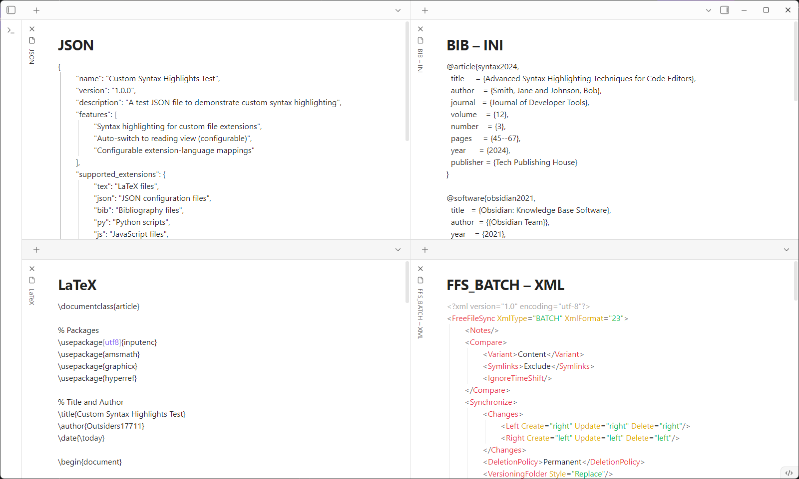
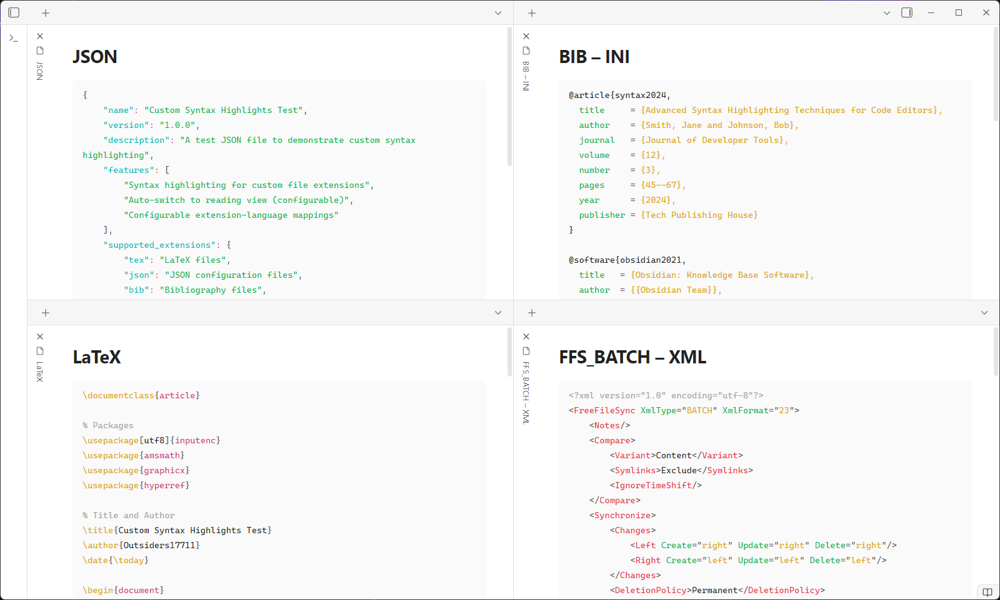

# Custom Syntax Highlights

[](https://github.com/Outsiders17711/Obsidian-Custom-Syntax-Highlights/releases)
[](LICENSE)
[](https://nodejs.org/)

An Obsidian plugin that displays files with custom extensions as syntax-highlighted code blocks in reading view, with configurable extension-to-language mappings.

## Features

- **Custom Extension Mapping**: Configure any file extension to display with specific syntax highlighting
- **Auto-Switch to Reading View**: Automatically switch configured file extensions to reading view when opened
- **Flexible Language Support**: Map extensions to any supported syntax highlighting language
- **Clean Display**: Files are rendered as single, properly formatted code blocks

## Demo

<div style="display: flex; gap: 10px; align-items: flex-start;">
<div style="flex: 1; text-align: center;">

***Source Mode***
[](docs/demo-Source-Mode.png)
*click to enlarge*

</div>
<div style="flex: 1; text-align: center;">

***Reading Mode***
[](docs/demo-Reading-Mode.png)
*click to enlarge*

</div>
</div>

## Installation

### From Community Plugins (Recommended)
*Coming soon - plugin is pending review for the official community plugin directory.*

### Manual Installation
1. Download the latest release from [GitHub Releases](https://github.com/Outsiders17711/Obsidian-Custom-Syntax-Highlights/releases)
2. Extract `main.js`, `manifest.json`, and `styles.css` to your vault's `.obsidian/plugins/custom-syntax-highlights/` directory
3. Reload Obsidian and enable the plugin in Settings → Community plugins

## Configuration

### Extension Mappings

Configure extension-to-language mappings in **Settings → Community plugins → Custom File Extensions**:

- **Extension**: The file extension (without the dot)
- **Language**: The syntax highlighting language to use (leave empty to use the extension name)

### Example Configurations

| Extension | Language  | Result                                           |
| --------- | :-------: | ------------------------------------------------ |
| `tex`     | _(empty)_ | LaTeX files with TeX syntax highlighting         |
| `json`    | _(empty)_ | JSON files with JSON syntax highlighting         |
| `bib`     |   `ini`   | Bibliography files with INI-style highlighting   |
| `py`      | `python`  | Python files with Python syntax highlighting     |
| `txt`     |   `md`    | Text files with normal editing (no highlighting) |

### Important Notes

- **Markdown files (`.md`)**: Not supported - handled natively by Obsidian
- **Normal editing**: Set language to `md` or `markdown` to disable highlighting and enable normal editing
- **Auto-switch**: Toggle whether files automatically open in reading view

## Usage

1. Configure extension mappings in plugin settings
2. Open any file with a configured extension
3. File automatically switches to reading view with syntax highlighting

## Development

### Building
```bash
npm install    # install dependencies
npm run dev    # development build with watch mode
npm run build  # production build
npm run test   # update the plugin in the test vault
```

### Release
```bash
npm run release        # automated patch release
npm run release:minor  # minor version release  
npm run release:major  # major version release
```

**Requirements**: Node.js 16+, Git repository with GitHub origin

## Documentation

- **[Release Process](docs/RELEASE.md)** - Complete guide for maintainers
- **[Changelog](docs/CHANGELOG.md)** - Version history and release notes

## Inspiration

Built upon the foundation of [MeepTech/obsidian-custom-file-extensions-plugin](https://github.com/MeepTech/obsidian-custom-file-extensions-plugin) for file extension registration. This plugin now implements a complete 2-in-1 solution with both file extension registration and syntax highlighting.

## License

MIT License
